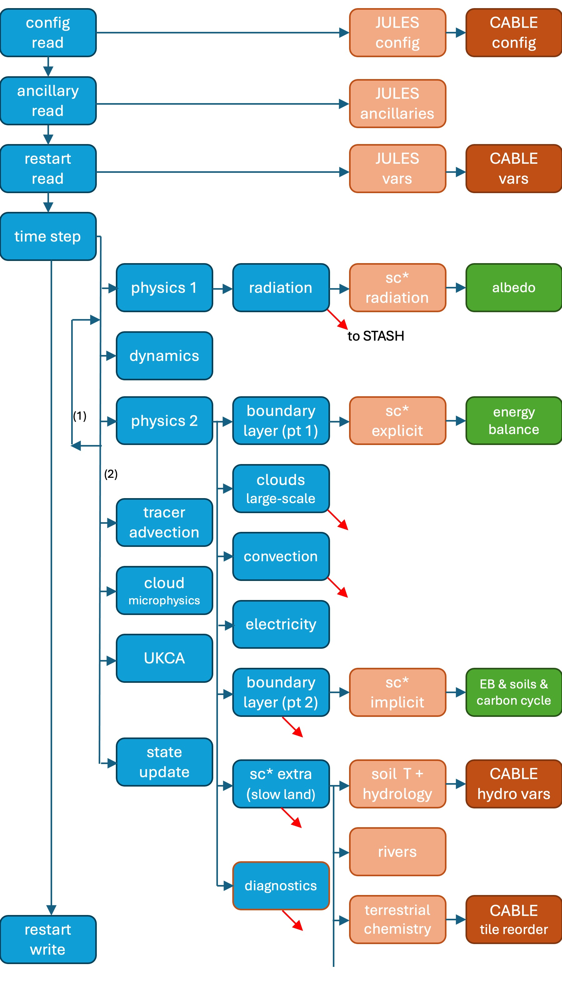
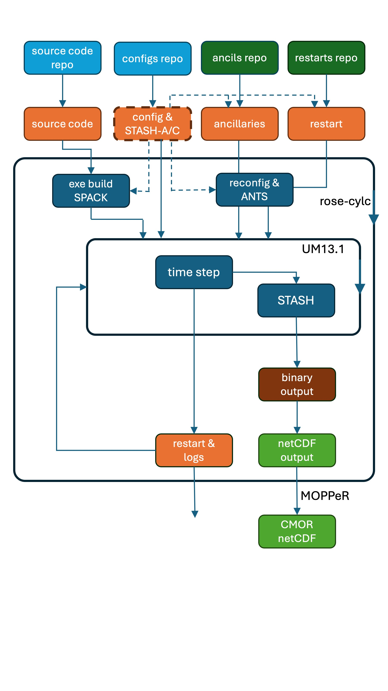

# CABLE

Introductory paragraph.

## Subheading 1

Legend:
- BLUE is UM code
- BEIGE is JULES code
- BROWN is JULES-CABLE coupling code (no science)
- GREEN is CABLE science code and JULES-CABLE coupling code (where necessary)
- DIAGONAL LINES indicate links to output via STASH

## Subheading 2

Legend:
- BLUE = Sourced from GitHub
- GREEN = Collections of inputs on vk83
- ORANGE = This experiment’s inputs (dashed is primary area of editing)
- DARK BLUE = in-cycle executions
- BROWN = Output that is deleted
- GREEN = Output that is retained